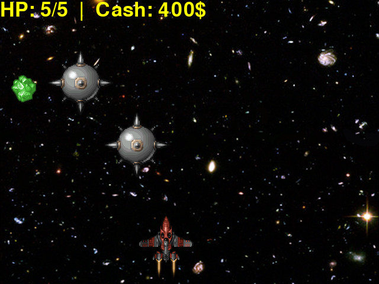

# Space-gatherer -> a basic video game
written using python3.8, pygame2

## OVERVIEW

N.B. this is not a shoot'em up!

## LAUNCHING THE GAME

You need to have Python installed & the pygame lib.
You can install pygame by typing:
  
 `python -m pip install pygame`

Then from the command line navigate to the `src` folder,
and simply type:
  
  `python main.py`

The game has been tested using Python 3.8 and pygame 2.0.1 (SDL 2.0.14, Python 3.8.10)

## LICENSE INFO
see the file LICENSE in this repo

## AUTHORS

game design-
   Andy Harris (check out his book
   Game Programming: The Express Line to Learning!)
   & Thomas Iwaszko (https://github.com/wkta)

programming-
   Thomas Iwaszko

graphics-
   Thomas Iwaszko
   & Daniel Cook (https://lostgarden.home.blog/) 

music-
   Patrick de Artega (https://patrickdearteaga.com)

sound design-
   Unknown authors
   & Thomas Iwaszko
